<!-- Source: mechanized_outreach_data_flow.md (from rippling-dbt/docs/) -->
<!-- Added: 2026-02-06 -->
<!-- Type: Documentation -->

# Unified Lead Database

This document describes the Unified Lead Database—the single source of truth for all prospecting leads at Rippling. It covers what data feeds into the database and what downstream systems consume from it.

## High-Level Architecture

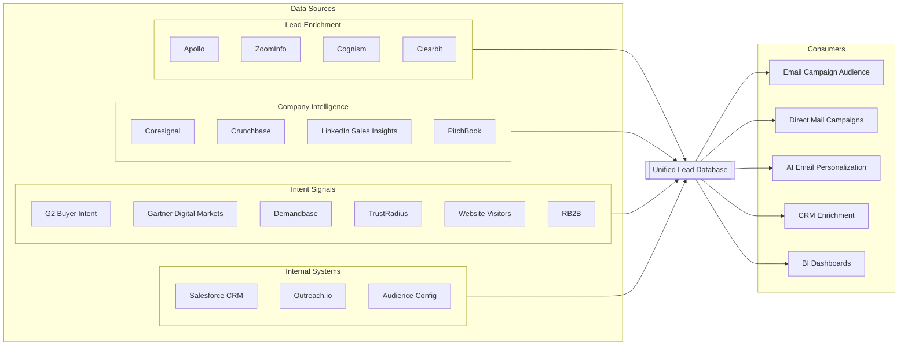

---

## Inputs: What Feeds the Database

### Lead Enrichment Vendors

Contact-level data is sourced from four vendors. Each provides overlapping but complementary information:

| Vendor | What It Provides |
|--------|------------------|
| Apollo | Contact info, job titles, direct dials, social profiles, company data |
| ZoomInfo | Verified emails, phone numbers, org charts, technographics |
| Cognism | GDPR-compliant European contacts, mobile numbers, intent data |
| Clearbit | Real-time enrichment, company firmographics, role detection |

**How leads are unified:**

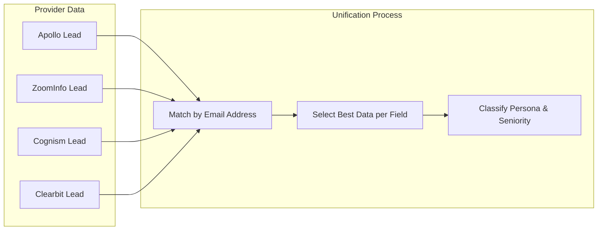

Each provider's data flows through normalization (intermediate models) before being merged into a single lead record. When multiple vendors have data for the same email, the system selects the most complete/accurate value per field.

**Key models:**

| Stage | Model | Description |
|-------|-------|-------------|
| Staging | `stg_mech_outreach__apollo_lead_enrichment` | Raw Apollo data extraction |
| Staging | `stg_mech_outreach__zoominfo_lead_enrichment` | Raw ZoomInfo data extraction |
| Staging | `stg_mech_outreach__cognism_lead_enrichment` | Raw Cognism data extraction |
| Staging | `stg_mech_outreach__clearbit_lead_search` | Raw Clearbit data extraction |
| Intermediate | `int_growth__apollo_lead_enrichment_output` | Normalized Apollo data |
| Intermediate | `int_growth__zoominfo_lead_enrichment_output` | Normalized ZoomInfo data |
| Intermediate | `int_growth__cognism_lead_enrichment_output` | Normalized Cognism data |
| Intermediate | `int_growth__clearbit_lead_enrichment_output` | Normalized Clearbit data |

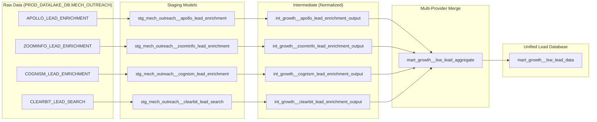

---

### Company Intelligence

Company-level data enriches leads with firmographic context:

| Source | What It Provides |
|--------|------------------|
| Coresignal | Job postings, employee counts, company details, hiring trends |
| Crunchbase | Funding rounds, investors, company stage, acquisition history |
| LinkedIn Sales Insights | Company profiles, employee growth, industry classification |
| PitchBook | Private company financials, M&A activity, investor data |

**Key models:**

| Stage | Model | Description |
|-------|-------|-------------|
| Staging | `stg_mech_outreach__coresignal_multi_companies` | Company data extraction |
| Intermediate | `int_growth__mo_coresignal_companies_most_recent` | Latest company snapshot |

```mermaid
flowchart LR
    subgraph RawSources ["Raw Data Sources"]
        CORESIGNAL_RAW["CORESIGNAL_MULTI_COMPANIES<br/>CORESIGNAL_DAILY_JOBS"]
        CRUNCHBASE_RAW["CRUNCHBASE_PEO<br/>CRUNCHBASE_TERMSHEET"]
        LINKEDIN_RAW["LINKEDIN_SALES_INSIGHTS_ACCOUNTS"]
        PITCHBOOK_RAW["PitchBook Data"]
    end
    
    subgraph Staging ["Staging Models"]
        CORESIGNAL_STG["stg_mech_outreach__coresignal_multi_companies"]
        CRUNCHBASE_STG["stg_mech_outreach__crunchbase_peo_companies<br/>stg_mech_outreach__crunchbase_termsheet_companies"]
        LINKEDIN_STG["stg_mech_outreach__linkedin_sales_insights_accounts"]
    end
    
    subgraph Intermediate ["Intermediate Processing"]
        CORESIGNAL_INT["int_growth__mo_coresignal_companies_most_recent<br/>int_growth__mo_coresignal_jobs_most_recent"]
        CRUNCHBASE_INT["int_growth__crunchbase_funding_rounds_ext<br/>int_growth__crunchbase_organizations_ext"]
    end
    
    subgraph CompanyMart ["Company Data Marts"]
        CORESIGNAL_MART["mart_growth__mo_coresignal_companies_addresses"]
        CRUNCHBASE_MART["mart_growth__crunchbase_peo_companies<br/>mart_growth__crunchbase_termsheet_companies"]
    end
    
    subgraph MasterDomain ["Master Domain Sources"]
        MASTER["stg_growth__master_domain_sources"]
    end
    
    subgraph ULD ["Unified Lead Database"]
        LSW["mart_growth__lsw_lead_data"]
    end
    
    CORESIGNAL_RAW --> CORESIGNAL_STG --> CORESIGNAL_INT --> CORESIGNAL_MART
    CRUNCHBASE_RAW --> CRUNCHBASE_STG --> CRUNCHBASE_INT --> CRUNCHBASE_MART
    LINKEDIN_RAW --> LINKEDIN_STG
    PITCHBOOK_RAW --> MASTER
    
    CORESIGNAL_MART --> MASTER
    CRUNCHBASE_MART --> MASTER
    LINKEDIN_STG --> MASTER
    
    MASTER --> LSW
```

---

### Intent Signals

Behavioral signals indicate companies actively researching solutions:

| Source | Signal Type |
|--------|-------------|
| G2 | Category page views, product comparisons, review reads |
| Gartner Digital Markets | Vendor research activity on Capterra, GetApp, Software Advice |
| Demandbase | Account-level intent across the web |
| TrustRadius | Product reviews, buyer research activity |
| Clearbit Reveal | Anonymous website visitor identification |
| RB2B | Website visitor tracking with contact resolution |

**Key models:**

| Stage | Model | Description |
|-------|-------|-------------|
| Intermediate | `int_growth__intent_domain_g2_companies` | G2 intent signals by domain |
| Intermediate | `int_growth__intent_domain_gartner_events` | Gartner intent signals by domain |

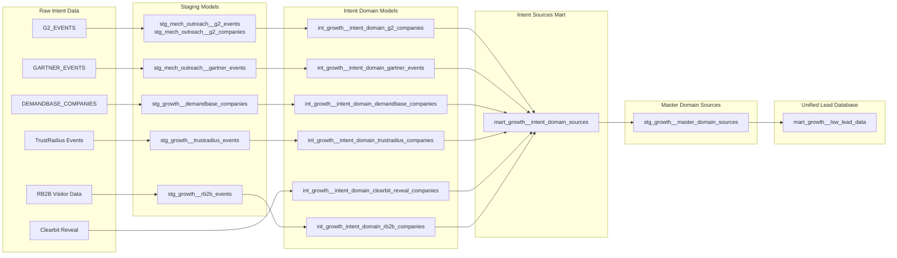

---

### Internal Systems

CRM and engagement platform data provides context on existing relationships:

| System | What It Provides |
|--------|------------------|
| Salesforce CRM | Existing leads, contacts, accounts, opportunities, ownership |
| Outreach.io | Email sequence status, engagement history, prospect records |
| Google Sheets | Audience configuration, suppression lists, campaign parameters |

**Key models:**

| Stage | Model | Description |
|-------|-------|-------------|
| Staging | `stg_sfdc__lead` | Salesforce lead records |
| Staging | `stg_sfdc__contact` | Salesforce contact records |
| Staging | `stg_sfdc__account` | Salesforce account records |
| Staging | `stg_outreach__sequence_state` | Email sequence membership |
| Staging | `stg_outreach__prospect` | Outreach prospect records |

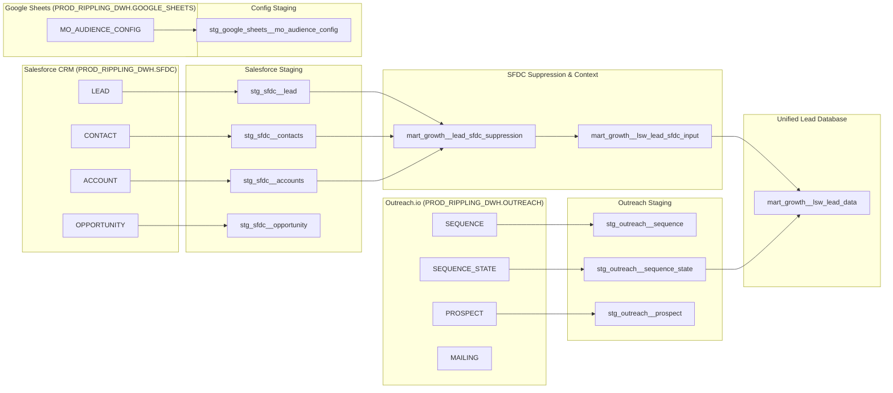

---

## The Unified Lead Database

The database consolidates all input sources into a single, deduplicated view of every prospecting lead.

### Core Models

| Model | Location | Purpose |
|-------|----------|---------|
| `mart_growth__lsw_lead_data` | `models/marts/growth/mart/lsw/` | **Primary unified lead table** - single source of truth |
| `mart_growth__lsw_lead_aggregate` | `models/marts/growth/mart/lsw/` | Multi-provider aggregation before final merge |

### Key Fields

The unified lead record includes:

- **Identity**: email, first_name, last_name, linkedin_url
- **Role**: title, persona, seniority, department
- **Company**: company_name, domain, industry, employee_count
- **Contact**: phone, mobile_phone, address
- **Enrichment**: enrichment_source, enrichment_date, data_quality_score
- **Salesforce**: lead_id, contact_id, account_id, owner

### Deduplication Logic

1. **Email as primary key**: All leads matched by lowercase email address
2. **Provider priority**: When multiple sources have conflicting data, a priority hierarchy determines the winning value
3. **Recency weighting**: More recent enrichment data may override older records
4. **Quality scoring**: Data completeness and validation status factor into field selection

---

## Outputs: What Uses the Database

### Email Campaign Audience

**Model**: `mart_growth__mo_eligible_audience`  
**Location**: `models/marts/growth/mart/mo_population/`

Determines which leads are eligible for automated email sequences based on:

- Suppression rules (existing customers, opt-outs, competitors)
- Sequence assignment logic
- Personalization flags for email content

**Destinations**: Outreach.io sequences, Brevo marketing campaigns

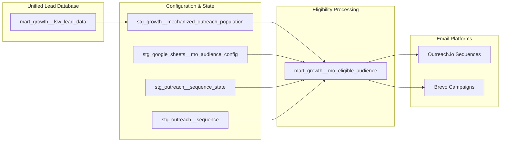

---

### Direct Mail Campaigns

**Model**: `mart_growth__direct_mail_lead_enrichment`  
**Location**: `models/marts/growth/mart/direct_mail/`

Provides verified mailing addresses for physical mail campaigns:

- Address validation and deliverability status
- Distance from Rippling offices (for local events)
- Mail-specific suppression rules

**Destination**: Lahlouh (print/mail fulfillment vendor)

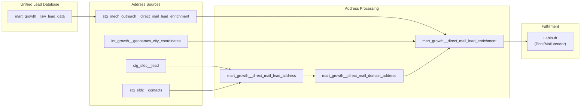

---

### AI Email Personalization

**Model**: `mart_growth__ai_email_contact_and_account_data`  
**Location**: `models/marts/growth/mart/ai_email/`

Provides context for AI-generated email content:

- Recent company news and milestones
- Funding events, hiring trends
- Past email engagement history
- Gong call summaries

**Destination**: AI email assistant tools for SDRs

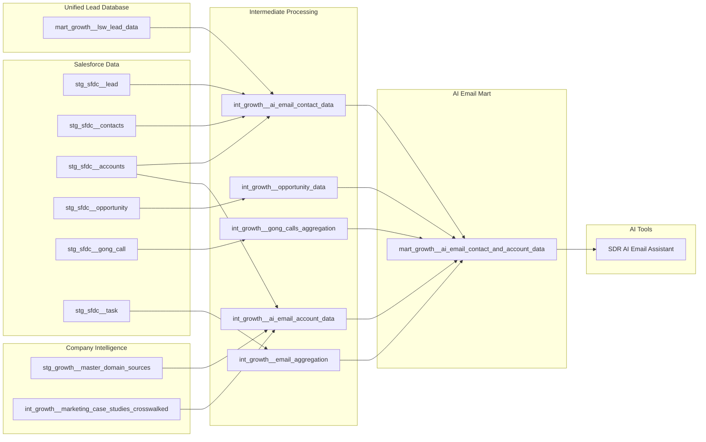

---

### CRM Enrichment

**Model**: `mart_growth__lsw_lead_data`

Enriched lead data flows back to Salesforce to:

- Fill in missing contact information
- Update job titles and company details
- Add intent signals and scoring

**Destination**: Salesforce CRM

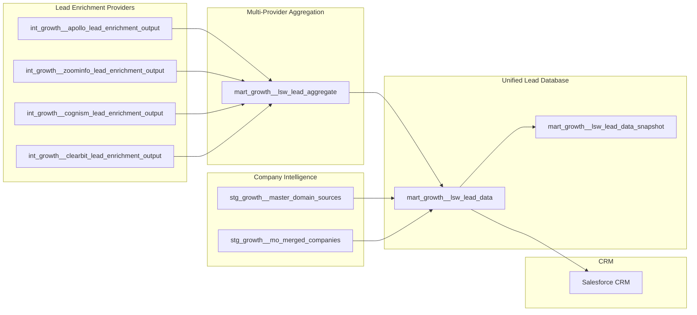

---

### BI Dashboards & Analytics

**Model**: `mart_growth__email_sends`  
**Location**: `models/marts/growth/mart/compliance/`

Tracks email engagement and compliance:

- Send/open/click/reply events
- Opt-out tracking
- Deliverability metrics
- Marketing attribution

**Destination**: BI dashboards, marketing analytics

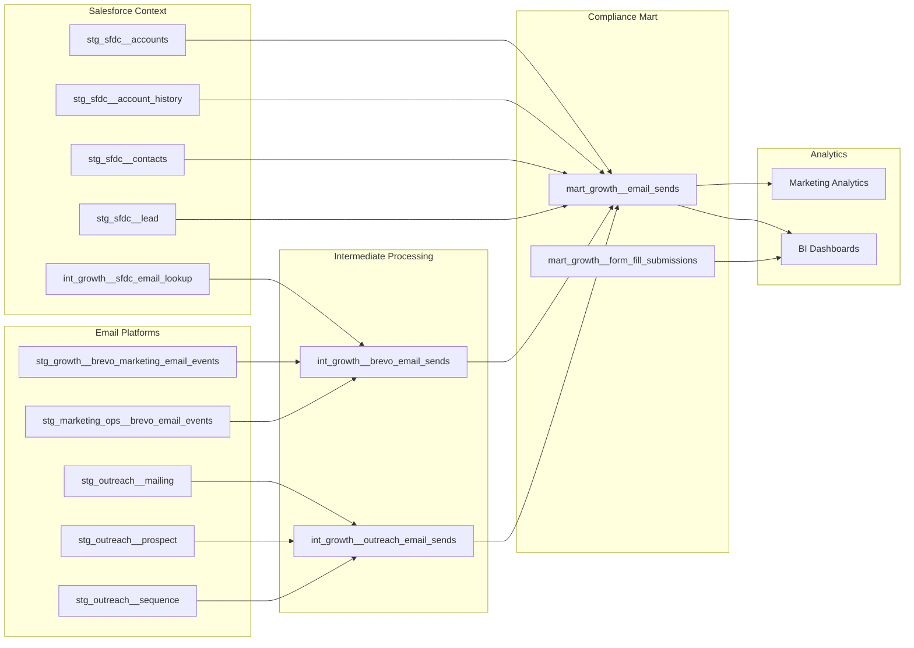

---

## External Data Source Reference

| Category | Source | Database/Schema | Key Tables | I/O |
|----------|--------|-----------------|------------|-----|
| Lead Enrichment | Apollo | `PROD_DATALAKE_DB.MECH_OUTREACH` | `APOLLO_LEAD_ENRICHMENT`, `APOLLO_LEAD_SEARCH` | Input |
| Lead Enrichment | ZoomInfo | `PROD_DATALAKE_DB.MECH_OUTREACH` | `ZOOMINFO_LEAD_ENRICHMENT`, `ZOOMINFO_LEAD_SEARCH` | Input |
| Lead Enrichment | Cognism | `PROD_DATALAKE_DB.MECH_OUTREACH` | `COGNISM_LEAD_ENRICHMENT`, `COGNISM_LEAD_SEARCH` | Input |
| Lead Enrichment | Clearbit | `PROD_DATALAKE_DB.MECH_OUTREACH` | `CLEARBIT_LEAD_ENRICHMENT`, `CLEARBIT_LEAD_SEARCH` | Input |
| Company Data | Coresignal | `PROD_DATALAKE_DB.MECH_OUTREACH` | `CORESIGNAL_DAILY_JOBS`, `CORESIGNAL_MULTI_COMPANIES` | Input |
| Company Data | Crunchbase | `PROD_DATALAKE_DB.MECH_OUTREACH` | `CRUNCHBASE_PEO`, `CRUNCHBASE_TERMSHEET` | Input |
| Intent Signals | G2 | `PROD_RIPPLING_DWH.GROWTH` | `G2_EVENTS` | Input |
| Intent Signals | Gartner | `PROD_RIPPLING_DWH.GROWTH` | `GARTNER_EVENTS` | Input |
| Intent Signals | Demandbase | `PROD_RIPPLING_DWH.GROWTH` | `DEMANDBASE_COMPANIES` | Input |
| CRM | Salesforce | `PROD_RIPPLING_DWH.SFDC` | `LEAD`, `CONTACT`, `ACCOUNT`, `OPPORTUNITY` | Both |
| Platform | Outreach.io | `PROD_RIPPLING_DWH.OUTREACH` | `SEQUENCE`, `SEQUENCE_STATE`, `PROSPECT`, `MAILING` | Both |
| Config | Google Sheets | `PROD_RIPPLING_DWH.GOOGLE_SHEETS` | `MO_AUDIENCE_CONFIG` | Input |
| Email Campaigns | Brevo | External | Marketing campaigns | Output |
| Direct Mail | Lahlouh | External | Print/mail fulfillment | Output |
| AI Email | AI Email Tools | External | SDR email personalization | Output |
| Analytics | BI Dashboards | External | Dashboards, marketing analytics | Output |
